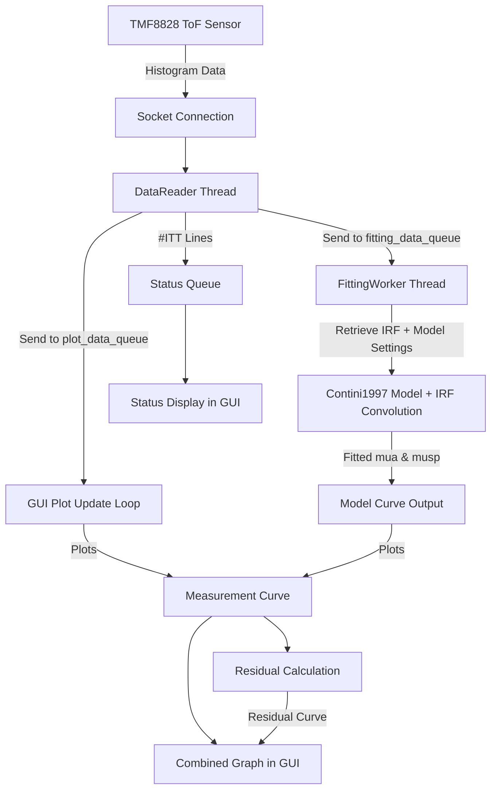

# TMF882X_RaspberryPi_Python_GUI

## How to run the program
1. install git (https://git-scm.com/downloads)
2. install python (https://www.python.org/downloads/)
3. clone the repository and cd into it:
   ```bash
   git clone https://github.com/chongyongshaun/TMF882X_RaspberryPi_Python_GUI.git
   cd TMF882X_RaspberryPi_Python_GUI/
   ```
4. install required python packages (Starting with Python 3.4, it is included by default with the Python binary installers, else install if needed)
   ``` bash
   pip install -r requirements.txt
   ```
5. connect the tmf module and run the TMF882X EVM GUI by AMS, make sure the connection is working
6. run the program 
   ``` bash
   python main.py
   ```

    6.5: NOTE, for stable fitting, please load in test_irf.csv provided in the "example csv/" folder

## Main functions to tweak and adjust for debugging and addtional features:
1. to add more parameters and options in the contini model panel, look at contini_model_panel.py
   - create_widgets() -> this is where you would change placement or add new params option, also change self.params
   - apply_settings() -> any processing before settings is applied to self.params (which is used by other classes such as the main class, they can call get_settings() and get access to the params listed in this class)
2. to change visualizations of the graph/tweak before plotting onto the main graph, look at main.py, there are ***5*** main functions that handle the loop that indefinitely updates the plot like an animation
   - update_plot() this processes and plots the data acquired from TMF through self.reader (which is initialized from DataReader class in TMF8828PiDataReader.py)
   - handle_fit_result() this is a callback function (a function that is called by fitting worker whenever it is done with a new fit result), same as update_plot it updates the plot, but with fitted curve generated using fit result instead of measurement curve
   - update_irf_curve() same but updates the plot with a static image of the loaded irf
   - update_initial_guess_curve() same but with initial guess
   - update_status_display() processes the data from status_data_queue (strings starting with #ITT) and displaying it
**!!!NOTE: the data reader is a separate thread from the main GUI code, meaning,  it runs independantly and as far as the thread is concerned, all it does is gets data from tmf and puts it into plot_data_queue (used by update_plot), fit_data_queue (used by fitting worker), the status data queue as well as saving this data to csv if enabled**
3. to change any GUI visuals, look at their build functions which create the components for the tkinter program
   - Control and Model Tab (1st page)
      - self.build_control_panel()
      - self.build_channel_selector()
      - self.build_model_panel()
   - Graph Tab (2nd page)
      - self.build_status_display()
      - self.build_graph_frame_misc()

## Software Flow of the Codebase

### 1. Data Acquisition and Flow
- Source: Data is acquired from a TMF (Time-of-Flight) device via a TCP socket connection. The DataReader sends a command (m0) to trigger a measurement.

- Raw Data Format: The device sends back a response string. The relevant histogram data for each channel is contained in lines starting with #HLONG, followed by the channel number and a semicolon-separated list of integer values.

- Distribution: The DataReader acts as a data broadcaster. When it receives a new data line for a selected channel, it places the raw string into two separate Queue objects:

- plot_data_queue: Consumed by the GUI for real-time plotting.

- fitting_data_queue: Consumed by the FittingWorker for live model fitting.

### 2. Live Data Processing and Analysis
The data, once in the queues, is processed by two main components: the ContiniModelPanel (for visualization) and the FittingWorker (for analysis).

#### 2.1. The FittingWorker
The FittingWorker is a dedicated thread that handles the computationally intensive task of fitting the diffusion model to the measured data.

- Input: It continuously pulls the latest data string from the fitting_data_queue.

- Parsing: The data string is parsed into a NumPy array of integer values.

- Preprocessing (fit_least_squares -> preprocess): The raw data is prepared for fitting:

- Interpolation: The number of data points can be increased by a configurable interp_factor to smooth the curve and improve fit resolution.

- Background Subtraction: The average noise level from a specified "noise window" is subtracted from both the measurement data and the IRF.

- Filtering: An optional filter_largest_peak can be applied to remove all data except for the main peak and its immediate surroundings. This helps eliminate noise and secondary reflections.

- Normalization: The data can be normalized to its peak value or by its area within a given region of interest (ROI).

- Model Fitting: The core of the process is the fit_least_squares function, which uses scipy.optimize.least_squares to perform the fit.

- Objective Function: The fun_residual function calculates the difference between the preprocessed measured data and the output of the theoretical model() function.

- Forward Model (model): This function generates the theoretical curve. It takes the user-defined parameters (ρ, μ 
a
​
 , μ 
s
′
​
 , etc.) and the loaded IRF as input. Crucially, it performs a Fast Fourier Transform convolution (scipy.signal.fftconvolve) of the theoretical Contini model with the IRF to simulate the real-world measurement.

- Optimization: The algorithm minimizes the residuals by adjusting the parameters μ a
 , μ 
s
′
​
 , and the temporal shift. It uses the TRF method with bounds to ensure physical plausibility (e.g., absorption and scattering coefficients must be non-negative).

- Output: The fitting results (the optimized parameters μ 
a
​
 , μ 
s
′
​
 , and shift, along with cost and other metrics) are sent back to the GUI via a result_callback function.

### 3. User Interface and Visualization
The ContiniModelPanel serves as the primary interface for the user to interact with the model and view results.

- Parameter Control: The panel provides a grid of input fields where the user can set values for all model parameters. The "Apply Settings" button updates the internal self.params dictionary, which is then accessed by the FittingWorker via the get_settings() function.

Model Computation:

- "Contini" button: Calculates and plots the raw theoretical Contini model output (reflectance and transmittance) for the current parameters.

- "Contini & Convolve IRF" button: Calculates and plots the result of convolving the theoretical model with the loaded IRF.

- Data Visualization: The panel features three live plots that are updated dynamically:

- IRF: Displays the Instrument Response Function loaded from a CSV file.

- Contini: Shows the theoretical, unconvolved model curve.

- Convolved: Shows the result of the convolution, representing the expected measurement.

- File I/O: The panel allows the user to load an IRF from a CSV file and to save the calculated model curves to a CSV.

- User Settings: The panel includes options for toggling the y-axis scale (linear vs. log) and a "Save to CSV" checkbox.

### Summary Chart



